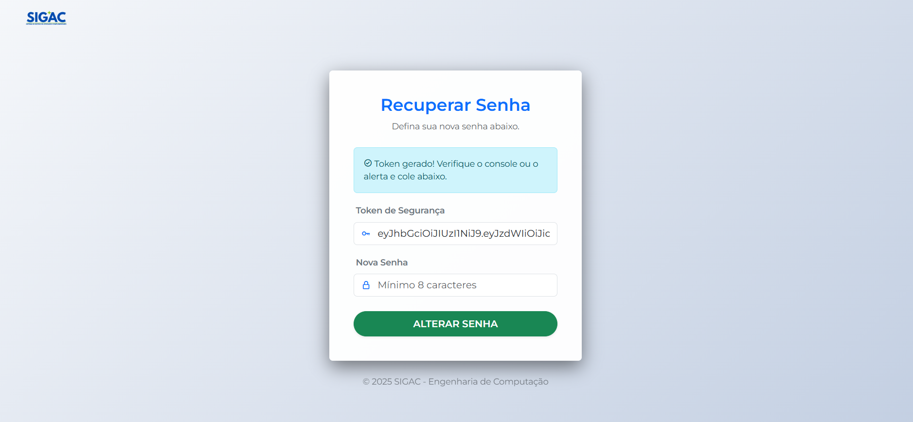
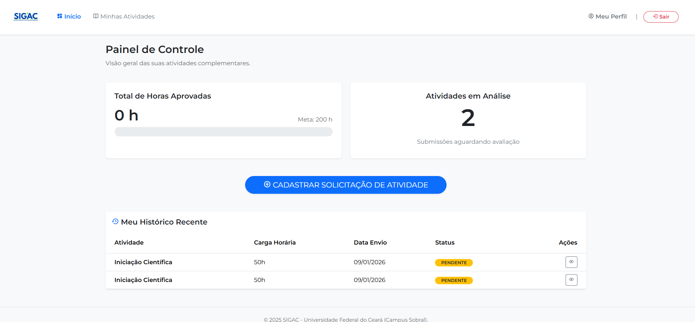
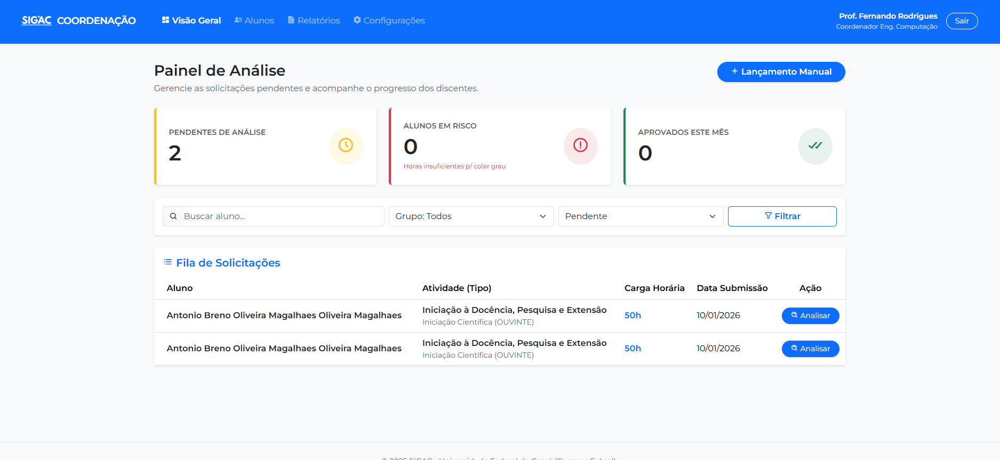
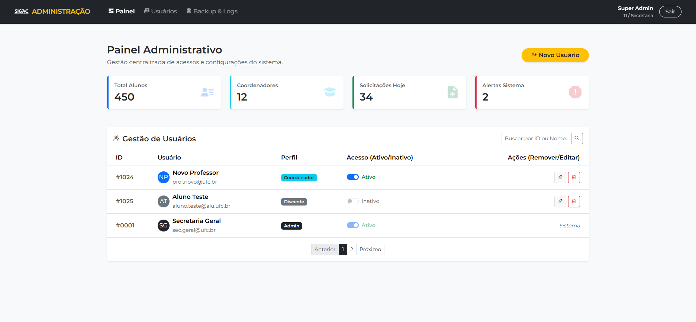

# 🎓 SIGAC - Sistema de Gerenciamento de Atividades Complementares

> Sistema web completo para submissão, análise e validação de horas complementares em instituições de ensino superior.


---

## 🖼️ Telas do Sistema

### 🔐 Login e Segurança
Acesso seguro com autenticação via Token JWT.



### 👨‍🎓 Painel do Aluno
O aluno acompanha seu progresso gráfico, envia certificados (PDF/IMG) e visualiza o status.


### 👩‍🏫 Painel do Coordenador
Área para deferimento/indeferimento de horas, com visualização de comprovantes e justificativas.


### ⚙️ Painel Administrativo
Gestão completa de usuários (CRUD), ativação de contas, backups e métricas do sistema.


---

## 🚀 Sobre o Projeto

O **SIGAC** automatiza o fluxo de atividades complementares de forma rápida e fácil, que antes era feito pelo sistema legado e pouco intuitivo/informativo da Universidade Federal do Ceará (SIGAA).

A arquitetura é dividida em:
1.  **Back-end (API):** Desenvolvido em Java/Spring Boot, responsável pela lógica, banco de dados e segurança.
2.  **Front-end (Cliente):** Interface desenvolvida em HTML/JS puro, consumindo a API via Fetch.

---

## 📦 Como Executar o Projeto

Como o sistema é dividido em duas partes, você precisa rodar o **Back-end** primeiro.

### Pré-requisitos
* Java JDK 21+
* PostgreSQL (Instalado e rodando)
* IDE de sua preferência (IntelliJ, VS Code, Eclipse)

### 1️⃣ Passo 1: Preparar o Banco de Dados
1.  Abra seu gerenciador de banco (PgAdmin, DBeaver, ou Terminal).
2.  Crie um banco de dados chamado **`ativufc`**.
    ```sql
    CREATE DATABASE ativufc;
    ```

### 2️⃣ Passo 2: Executar o Back-end (API)
O Front-end precisa que a API (desenvolvida por **[@fcolucasvieira](https://github.com/fcolucasvieira)**) esteja online para funcionar.

1.  Clone o repositório da API:
    ```bash
    git clone [https://github.com/fcolucasvieira/ativufc-api.git](https://github.com/fcolucasvieira/ativufc-api.git)
    ```
2.  Abra o projeto na sua IDE (ex: IntelliJ).
3.  **Configuração Importante:** Na pasta raiz do projeto clonado (onde fica o `pom.xml`), crie manualmente a seguinte estrutura de pastas para salvar os arquivos de upload:
    ```text
    ativufc-api/
    └── uploads/
        └── comprovantes/
    ```
4.  Execute a aplicação (Classe `AtivufcApplication.java`).
    * *O Flyway irá criar as tabelas e usuários iniciais automaticamente.*

### 3️⃣ Passo 3: Executar o Front-end (Este Repositório)
Agora que o servidor está rodando, inicie a interface.

1.  Clone este repositório:
    ```bash
    git clone [https://github.com/brnz4n/SIGAC.git](https://github.com/brnz4n/SIGAC.git)
    ```
2.  Abra a pasta do projeto.
3.  Abra o arquivo `index.html` no seu navegador.
    * *Dica: Use a extensão "Live Server" do VS Code para uma melhor experiência.*

---

## 👤 Usuários para Teste

O sistema já vem com usuários pré-configurados para facilitar o teste:

| Perfil | E-mail | Senha | Descrição |
| :--- | :--- | :--- | :--- |
| **Admin** | `admin@ufc.com` | `Ufcadmin@sigac0` | Acesso total ao sistema e gestão de usuários. |
| **Coordenador** | `coord@ufc.br` | `Coord011@` | Valida atividades e visualiza relatórios. |
| **Aluno** | *(Criar no Cadastro)* | *(Sua escolha)* | Envia atividades e consulta horas. |

---

## 🛠️ Tecnologias

* **Front-end:** HTML5, CSS3, JavaScript (ES6+), Bootstrap 5.
* **Back-end:** Java 21, Spring Boot 3, Spring Security (JWT).
* **Banco de Dados:** PostgreSQL, Flyway (Migração).

---

## 👨‍💻 Autores

Este projeto foi desenvolvido em colaboração:

| Desenvolvedor | Papel | GitHub |
| :--- | :--- | :--- |
| **Breno Magalhães** | **Front-end** (Interface e Integração) | [@brnz4n](https://github.com/brnz4n) |
| **Lucas Vieira** | **Back-end** (API, Banco de Dados e Regras) | [@fcolucasvieira](https://github.com/fcolucasvieira) |

---
